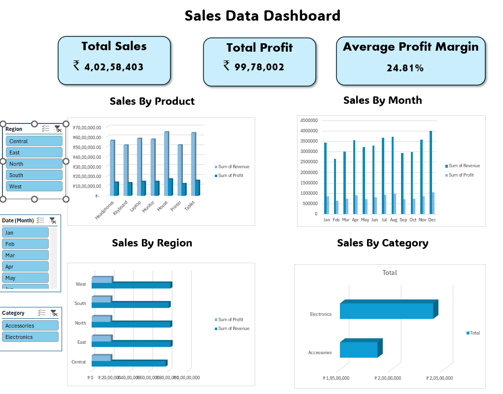

# 📊 Excel Dashboard for Business KPIs

## Problem  
Businesses often struggle to track performance across multiple KPIs.  
The goal was to design an **interactive Excel dashboard** to provide clear visibility into metrics such as revenue, profit, and regional performance.  

## Approach  
- Structured raw sales data into a clean, tabular format (CSV).  
- Applied **Pivot Tables, KPI cards, Charts, and Slicers** in Excel.  
- Designed a **visually intuitive dashboard** for KPI monitoring and executive reporting.  

## Tools  
- **Excel** (Pivot Tables, Slicers, Charts, Conditional Formatting)  
- **CSV (Raw Dataset)**  

## Results  
- Developed an **interactive dashboard** summarizing revenue, profit, and profit margin KPIs.  
- Identified **top products, regions, and categories** driving growth.  
- Improved decision-making speed by turning raw data into **actionable insights**.  

## Screenshots  

 

## Repository Structure  
┣ data/ # sample dataset (CSV)
┣ outputs/ # final Excel dashboard + images
┗ README.md # project overview
